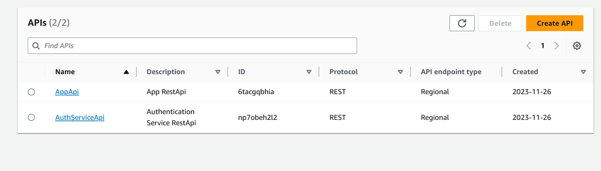
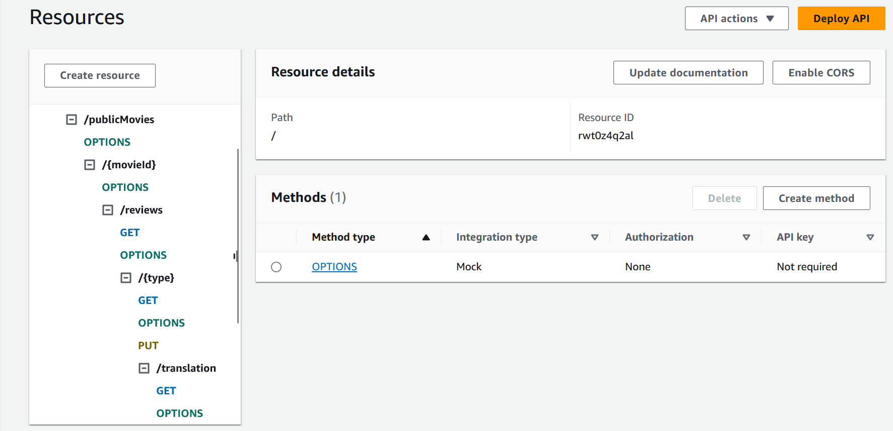
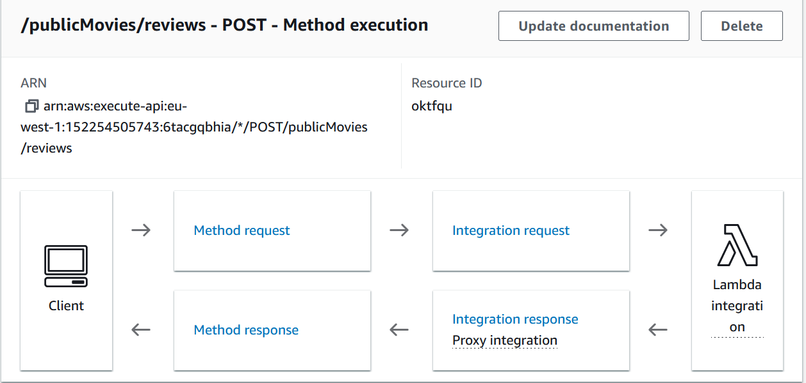
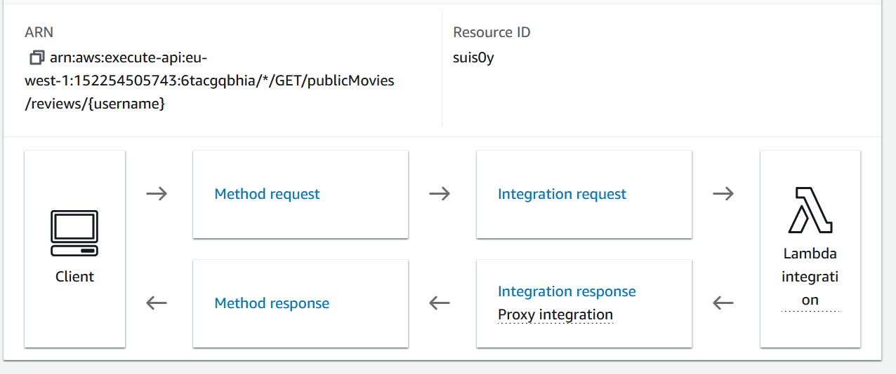
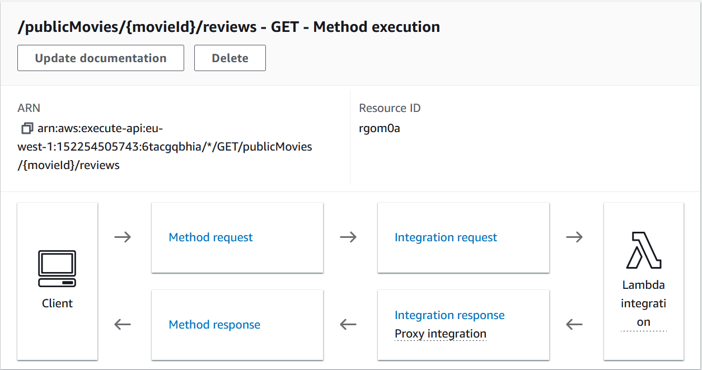
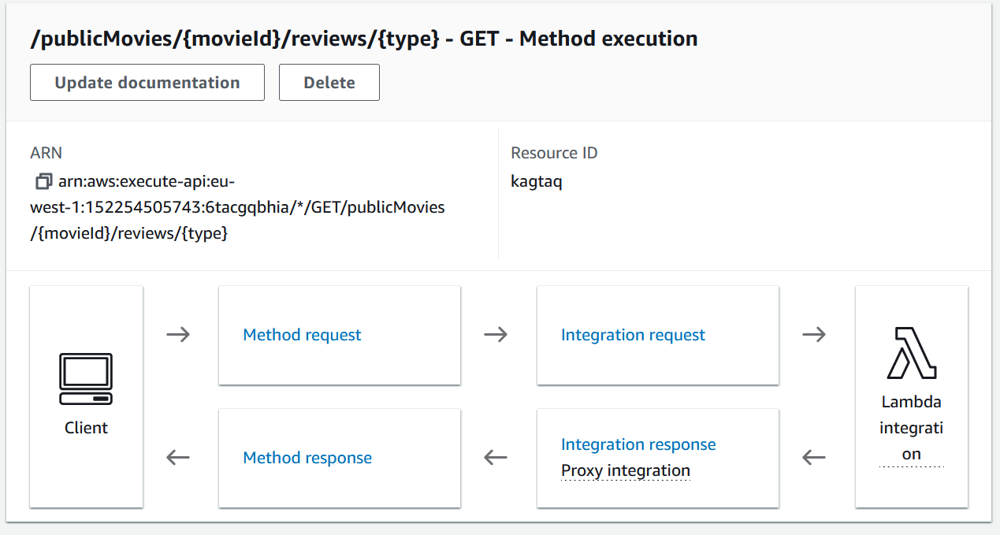
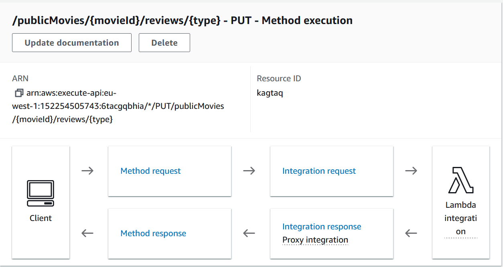
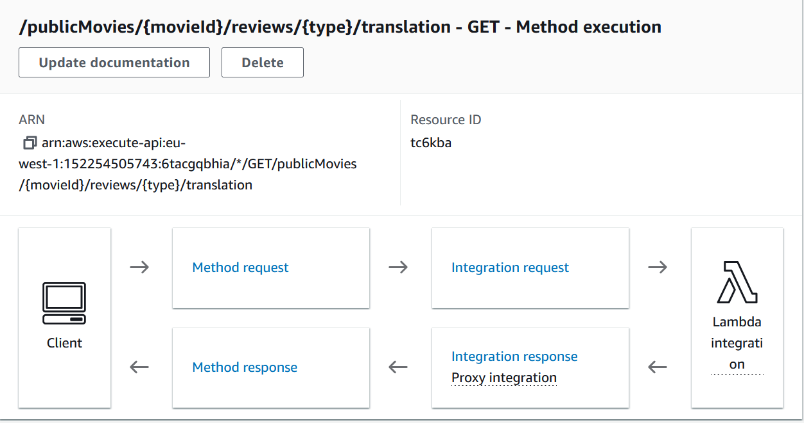

## ServerlessREST Sddignment - Distributed Systems.

__Name:__ Conor Gleeson

This repository contains the implementation of a serverless REST API for the AWS platform. A CDK stack creates the infrastructure. The domain context of the API is movie reviews.

### API endpoints.

[ Provide a bullet-point list of the app's endpoints (excluding the Auth API endpoints).]
e.g.
 
+ POST /publicMovies/reviews - add a movie review.
+ GET /publicMovies/{movieId}/reviews - Get all the reviews for a movie with the specified id.
+ GET /publicMovies/{movieId}/reviews?minRating=n - Get all the reviews for the movie with the specified ID with a rating greater than the minRating.
+ GET /publicMovies/{movieId}/reviews/{reviewerName} - Get the review for the movie with the specified movie ID and written by the named reviewer.
+ PUT /publicMovies/{movieId}/reviews/{reviwerName} - Update the text of a review
+ GET /publicMovies/{movieId}/reviews/{year} - Get the review for the movie with the specified movie ID and written in a specified year.
+ GET /publicMovies/reviews/{reviewerName} - Get all the reviews written by a specific reviewer.
+ GET /movies/{movieId}/reviews/{reviewerName}/translation?language=code - Get a translated version of the review for the movie with the specified movie ID and written by the      named reviewer.

### Api Gateway

This image shows the deployed API

This image shows the API with the list of avalible resources

This image shows the endpoint to add a review

This image shows the endpoing to get all the reviews written by a specified user

This image shows the endpoint to get all the reviews for a specified movie

This image shows the endpoint to get the reviews for a specified movie by either a specified year or username

This image shows the put endpoint to update a review

This image shows the endpoint to get a review for a movie written by a specified reviewer and then translate it to a chosen language

### Authentication..

This image shows of a confirmed user in the cognito user pool

### Independent learning (If relevant).

[ Briefly explain any aspects of your submission that required independent research and learning, i.e. not covered in the lectures/labs. State the files that have evidence of this.

State any other evidence of independent learning achieved while completing this assignment.

